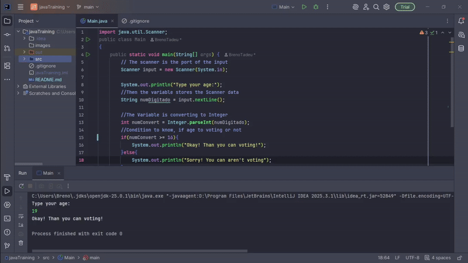

# Simple voting system! Does not have separations by folders.

Simple voting system! Where the age is definition to know if can voting or not.
I used if/else for condition and Scanner to write to console

---
the execution:

---

